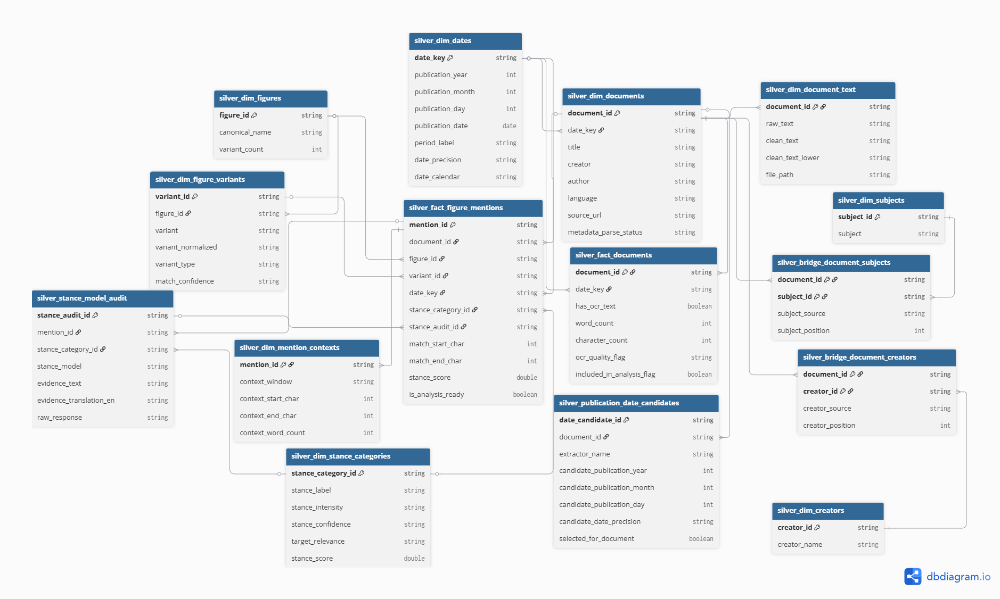

# Data Model

This project uses a medallion architecture:

- Bronze tables preserve raw OCR text and metadata.
- Silver tables clean, parse, normalize, and model the data.
- Gold tables provide dashboard-ready aggregates.

The main analytical grain is figure mentions in historical documents. The silver layer uses a dimensional model so document-level facts, mention-level facts, metadata dimensions, and model audit outputs stay separate and explainable.

## Silver dimensional model

## Why this model is dimensional

The silver layer is organized around two main fact tables:

- `silver_fact_documents`: one row per document.
- `silver_fact_figure_mentions`: one row per detected mention of a historical figure.

These fact tables are surrounded by dimensions that describe documents, dates, figures, text, creators, subjects, context windows, and stance categories.

This avoids one very wide table that mixes multiple grains, such as one row per document, one row per mention, one row per subject, and one row per creator.

## Table grains

| Table | Grain | Purpose |
|---|---|---|
| `silver_dim_documents` | One row per document | Descriptive metadata such as title, language, source URL, and selected publication date fields. |
| `silver_fact_documents` | One row per document | Measured document-level facts such as word count, OCR quality, and inclusion flags. |
| `silver_dim_dates` | One row per selected publication date or period | Shared date dimension used by document and mention facts. |
| `silver_dim_document_text` | One row per document | Raw and cleaned OCR text. Kept separate because text fields are large. |
| `silver_dim_figures` | One row per tracked historical figure | Canonical figure records. |
| `silver_dim_figure_variants` | One row per figure name variant | Dictionary entries used for matching figure mentions in OCR text. |
| `silver_fact_figure_mentions` | One row per detected figure mention | Main mention-level fact table with document, figure, variant, date, location, and selected stance fields. |
| `silver_dim_mention_contexts` | One row per mention | Context window around each detected mention. |
| `silver_dim_stance_categories` | One row per stance category combination | Normalized stance label, intensity, confidence, relevance, and deterministic score. |
| `silver_stance_model_audit` | One row per model-scored mention | Raw AI response, evidence text, English translation, and explanation. |
| `silver_dim_creators` | One row per creator/author name | Normalized creator or author names from metadata. |
| `silver_bridge_document_creators` | One row per document-creator relationship | Handles documents with multiple creators. |
| `silver_dim_subjects` | One row per subject term | Normalized subject metadata. |
| `silver_bridge_document_subjects` | One row per document-subject relationship | Handles documents with multiple subjects. |
| `silver_publication_date_candidates` | One row per document/date candidate | Audit table for rule-based and AI-extracted publication date candidates. |

## Main relationships

### Document relationships

Each document has:

- one row in `silver_dim_documents`
- one row in `silver_fact_documents`
- one row in `silver_dim_document_text`
- zero or more creators through `silver_bridge_document_creators`
- zero or more subjects through `silver_bridge_document_subjects`
- zero or more publication date candidates in `silver_publication_date_candidates`

### Mention relationships

Each figure mention has:

- one parent document
- one matched figure
- one matched figure-name variant
- one date key inherited from the document’s selected publication date
- one context window
- optionally one stance category and one stance model audit record

## Why text is separated from the main document fact table

OCR text fields can be large. Keeping raw and cleaned text in `silver_dim_document_text` keeps analytical tables narrower and faster to query.

Most dashboard queries do not need full OCR text. They need document IDs, dates, counts, figures, stance scores, and metadata. The full text remains available when needed for validation or traceability.

## Why publication date candidates are separate

Publication dates come from multiple sources:

- metadata fields
- title text
- OCR front matter
- Databricks AI extraction

Instead of overwriting these intermediate results, the pipeline stores candidate dates in `silver_publication_date_candidates`.

The selected date is written back to:

- `silver_dim_documents`
- `silver_dim_dates`
- `silver_fact_documents`
- `silver_fact_figure_mentions`

This keeps the final model easy to query while preserving the evidence behind date selection.

## Why stance audit is separate from the mention fact table

The mention fact table stores the selected stance fields needed for analysis, such as:

- `stance_category_id`
- `stance_score`
- `is_analysis_ready`

The full AI model output is stored separately in `silver_stance_model_audit`.

This keeps the fact table compact while preserving model transparency, including:

- raw model response
- evidence text
- English translation
- explanation

## Gold layer

The gold layer contains dashboard-ready aggregations derived from the silver model.

Current gold tables include:

| Table | Grain | Purpose |
|---|---|---|
| `gold_figure_mentions_by_period` | One row per figure per period | Mention volume and document coverage over time. |
| `gold_figure_stance_by_period` | One row per figure per period | Average stance and stance distribution over time. |
| `gold_figure_stance_by_document` | One row per figure per document | Document-level stance aggregation to reduce bias from repeated mentions in one document. |
| `gold_top_stance_contexts` | One row per selected context passage | Representative positive and negative passages for dashboard drill-through. |
| `gold_figure_stance_by_creator_period` | One row per figure, creator, and period | Stance trends by creator/author. |
| `gold_figure_stance_by_subject_period` | One row per figure, subject, and period | Stance trends by subject metadata. |

## Design tradeoffs

This model intentionally favors explainability and traceability over compactness.

Benefits:

- clear table grain
- easier debugging
- better Power BI relationships
- support for many-to-many creators and subjects
- preserved audit trail for AI-extracted dates and stance scoring

Costs:

- more tables
- more joins
- more documentation needed